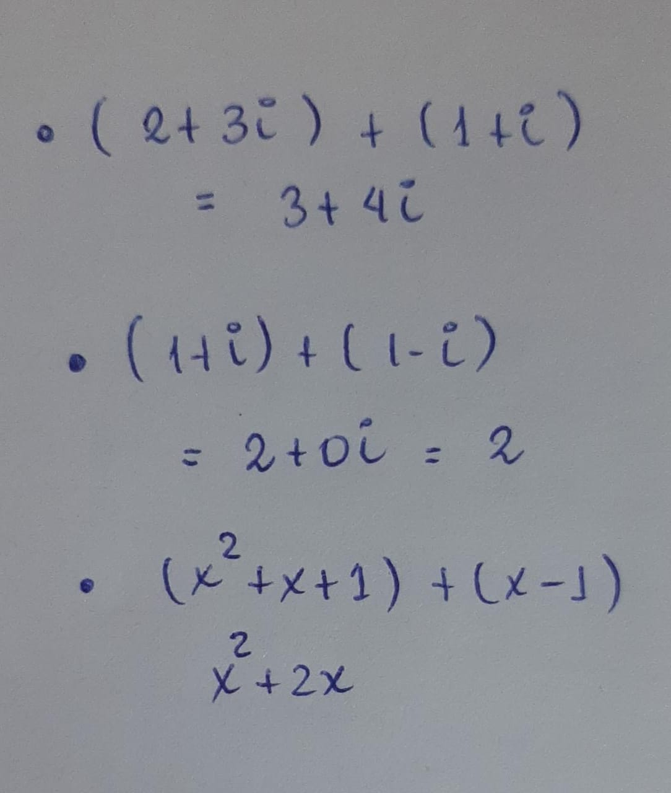
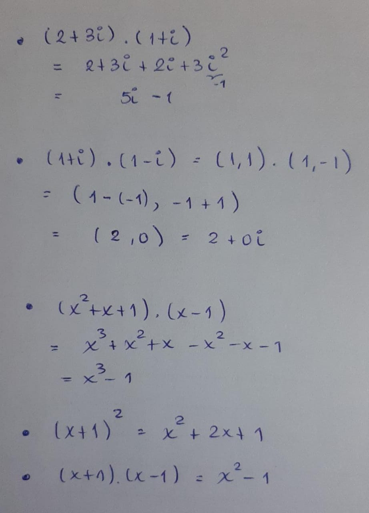
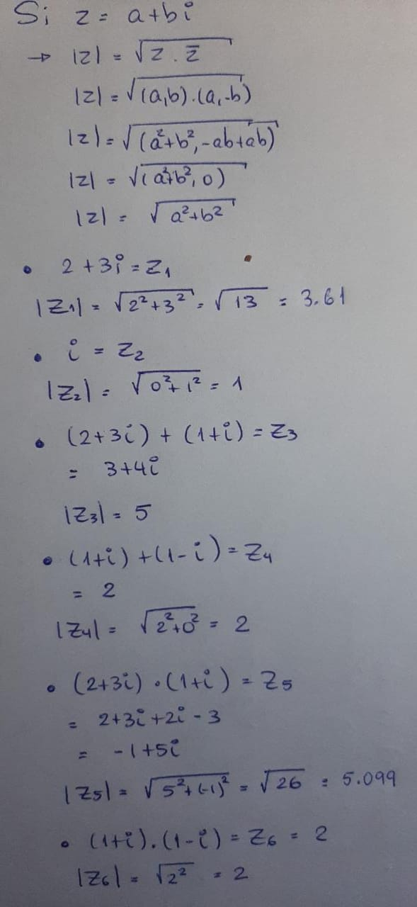
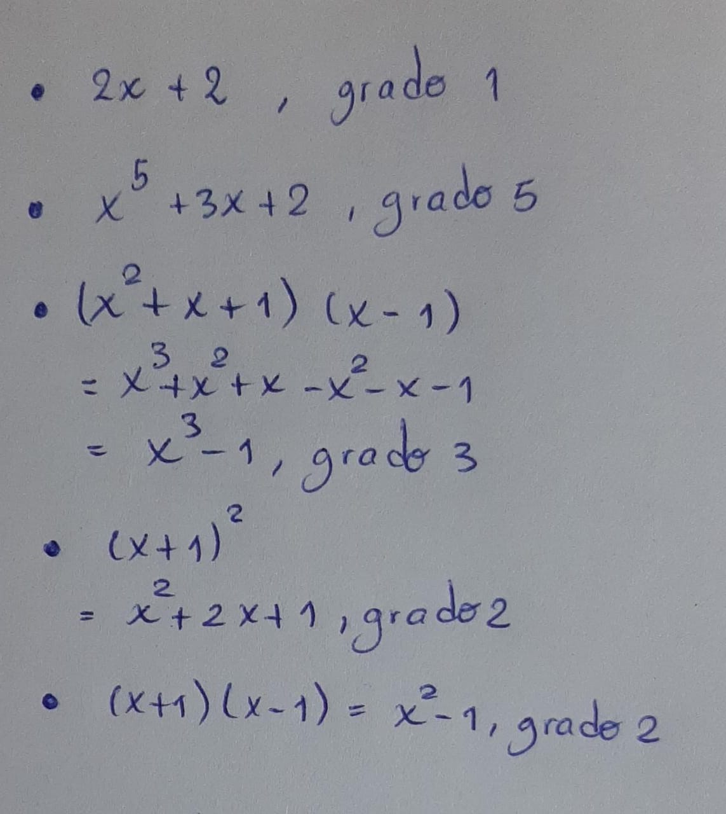
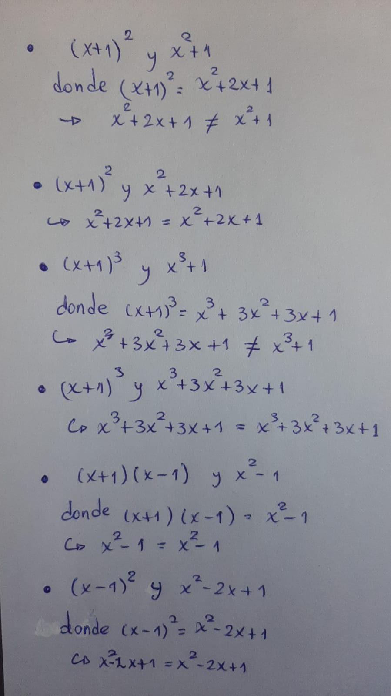
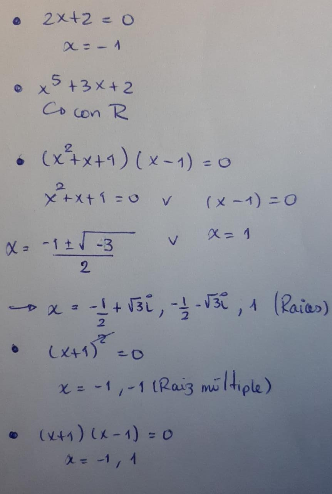

```{r setup, include=FALSE}
knitr::opts_chunk$set(echo = TRUE, comment = NA)
```

## Pregunta 1
¿Son los números enteros, $\mathbb{Z}$, un cuerpo? ¿Por qué? Razona tu respuesta?
Los números enteros no son un cuerpo, porque no cumple con la propiedad del único.


## Pregunta 2

Realiza las siguientes sumas a mano y comprueba tu respuesta en R, Python u Octave:

* $(2 + 3i) + (1 + i)$

* $(1 + i) + (1 − i)$

* $(x^2 + x + 1) + (x − 1)$

### Escrito a mano

```{r echo = FALSE, fig.align='center', out.width="25%"}

```

### En R

```{r}
(2 + 3i) + (1 + 1i)
(1 + 1i) + (1 - 1i)

library(polynom) # Se necesita la librería polynom
a <- polynomial(coef = c(1, 1, 1)) # coeficientes de derecha a izquierda: ascendente
b <- polynomial(coef = c(-1, 1)) 
a + b
```
### En python

```{python}
(2 + 3j) + (1 + 1j)
(1 + 1j) + (1 - 1j)
```


```{python message = FALSE}
import numpy as np # Se necesita la librería numpy
a = np.poly1d([1, 1, 1]) # coeficientes de izquierda a derecha: descendente
b = np.poly1d([1, -1])
print(a + b) 
```

### En Octave

```{octave}
z1 = (2 + 3i) + complex(1, 1) # no se utiliza ';' al final de la asignación
                              # para plotear la variable asignada
```

```{octave}
z1 = (2 + 3i) + complex(1, 1)
```

El proceso de a continuación solo es para sumar polinomios en octave

```{octave}
p = [1, 1, 1]; # coeficientes de izquierda a derecha: descendente
q = [1, -1]; # la ';' se utiliza para terminar la asignación de una variable
gradoP = length(p) - 1; 
gradoQ = length(q) - 1;
p = [zeros(1, gradoQ-gradoP), p]; # Completación de ceros para los de menor grado
q = [zeros(1, gradoP-gradoQ), q];
suma = p + q; # Solo es un vector
polyout(suma, 'x') # Asignación de la variable 'x' al vector (de coeficientes)
```


## Pregunta 3

Realiza los siguientes productos a mano y comprueba tu respuesta en R, Python u Octave:

* $(2 + 3i) · (1 + i)$
* $(1 + i) · (1 − i)$
* $(x^2 + x + 1) · (x − 1)$
* $(x + 1)^2$
* $(x + 1) · (x − 1)$

### Escrito a mano

```{r echo = FALSE, fig.align='center', out.width="40%"}

```

### En R

```{r}
(2 + 3i)*(1 + 1i)
(1 + 1i)*(1 - 1i)

library(polynom)
a <- polynomial(coef = c(1, 1, 1)) 
b <- polynomial(coef = c(-1, 1)) 
a * b
c <- polynomial(coef = c(1, 1)) 
c^2
c * b
```

### En python

```{python}
(2 + 3j) * (1 + 1j)
(1 + 1j) * (1 - 1j)
```


```{python message = FALSE}
import numpy as np # Se necesita la librería numpy
a = np.poly1d([1, 1, 1]) # coeficientes de izquierda a derecha: descendente
b = np.poly1d([1, -1])
print(a * b) 
c = np.poly1d([1, 1])
print(c ** 2)
print(c * b)
```

### En Octave

```{octave}
z1 = (2 + 3i) * (1 + 1i)

```

```{octave}
z1 = (1 + 1i) * (1 - 1i)
```

```{octave}
p = [1, 1, 1];
q = [1, -1]; 
m = [1, 1];
prod1 = conv(p, q); # No se necesita la completación de ceros
polyout(prod1,'x')
```
```{octave}
m = [1, 1];
prod2 = conv(m, m);
polyout(prod2, 'x')
```

```{octave}
m = [1, 1];
q = [1, -1];
prod3 = conv(m, q);
polyout(prod3, 'x')
```


## Pregunta 4

Calcula el módulo de los siguientes números complejos (realizando primero las operaciones pertinentes):

* $2 + 3i$
* $i$
* $(2 + 3i) + (1 + i)$
* $(1 + i) + (1 − i)$
* $(2 + 3i) · (1 + i)$
* $(1 + i) · (1 − i)$

### Escrito a mano

```{r echo = FALSE, fig.align='center', out.width="40%"}

```

### En R

```{r}
round(Mod(2 + 3i), 2)
Mod(1i)
Mod(3 + 4i)
Mod(2)
Mod(-1 + 5i)
Mod((1 + 1i) * (1 - 1i))
```

### En python

```{python}
round(abs(2 + 3j), 2)
abs(1j)
abs(3 + 4j)
abs(2)
abs(-1 + 5j)
abs((1 + 1j) * (1 - 1j))
```


### En Octave


```{octave}
z1 = round(abs(2 + 3i) * 100) / 100 # para redondear a dos cifras
```
```{octave}
z2 = abs(1i)

```

```{octave}
z3 = abs(3 + 4i)
```

```{octave}
z4 = abs(2)
```

```{octave}
z5 = abs(-1 + 5i)
```

```{octave}
z6 = abs((1 + 1i) * (1 - 1i))
```

## Pregunta 5

Indica el grado de los siguientes polinomios (realizando primero las operaciones pertinentes):

* $2x + 2$
* $x^5 + 3x + 2$
* $(x^2 + x + 1)(x − 1)$
* $(x + 1)^2$
* $(x + 1)(x − 1)$

### Escrito a mano

```{r echo = FALSE, fig.align='center', out.width="40%"}

```

### En R

Para $(x^2 + x + 1)(x − 1)$:

```{r}
a <- polynom::polynomial(coef = c(1, 1, 1))
b <- polynom::polynomial(coef = c(-1, 1))
print(paste0("Grado de ", as.character(a * b)," : ", as.character(length(a * b) - 1)))
```

### En python

Para $(x + 1)^2$:

```{python}
import numpy as np
a = np.poly1d([1, 1])
b = a ** 2
print("Grado de \n", b, " : ", b.order)
```


### En Octave

Para $(x + 1)(x − 1)$:

```{octave}
z1 = [1, 1];
z2 = [1, -1];
p = conv(z1, z2);
grade = length(p) - 1;

printf("Grado de "), polyout(p,'x'), printf("es "), printf(num2str(grade))
```

## Pregunta 6

¿Son iguales los siguientes polinomios?

* $(x + 1)^2$ y $x^2 + 1$
* $(x + 1)^2$ y $x^2 + 2x + 1$
* $(x + 1)^3$ y $x^3 + 1$
* $(x + 1)^3$ y $x^3 + 3x^2 + 3x + 1$
* $(x + 1)(x − 1)$ y $x^2 − 1$
* $(x − 1)^2$ y $x^2 − 2x + 1$

### Escrito a mano


```{r echo = FALSE, fig.align='center', out.width="40%"}

```

### En R
Para  $(x + 1)(x − 1)$ y $x^2 − 1$:

```{r}
a <- polynom::polynomial(coef = c(1, 1)) * polynom::polynomial(coef = c(-1, 1)) # izquierda
b <- polynom::polynomial(coef = c(-1, 0, 1)) # derecha
a == b # si se cumple la igualdad dar como resultado TRUE
```


## Pregunta 7

Encuentra las raíces de los siguientes polinomios:

* $2x + 2$
* $x^5 + 3x + 2$
* $(x^2 + x + 1)(x − 1)$
* $(x + 1)^2$
* $(x + 1)(x − 1)$

### Escrito a mano

```{r echo = FALSE, fig.align='center', out.width="30%"}

```

### En R

Para $x^5 + 3x + 2$:

```{r}
a <- polynom::polynomial(coef = c(2, 3, 0, 0, 0, 1))
r <-  polyroot(c(2, 3, 0, 0, 0, 1))
print(paste0("La raiz", as.character(1:length(a)), 
             " de ", as.character(a), " es ", as.character(r)))
```
